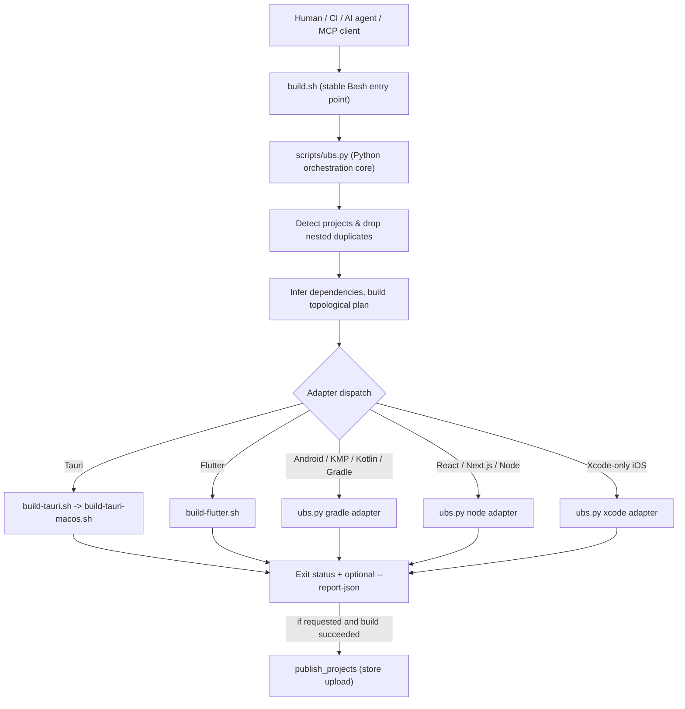
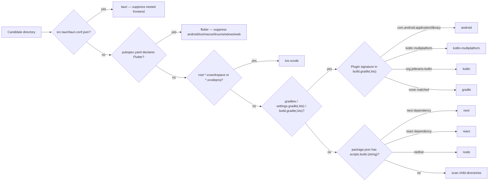
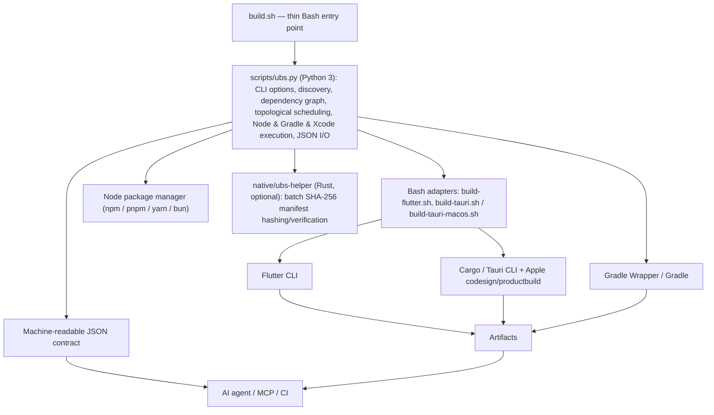
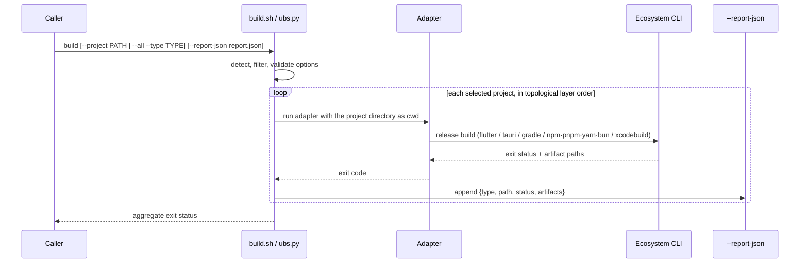
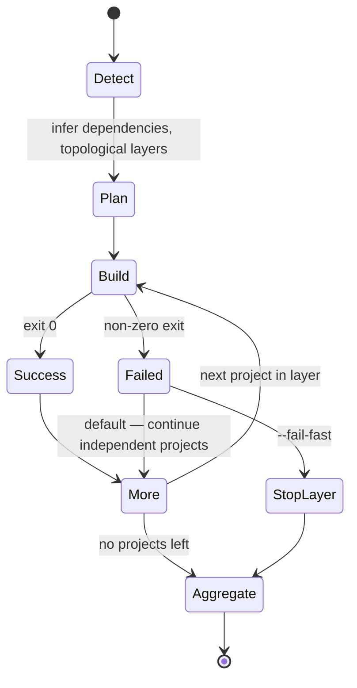
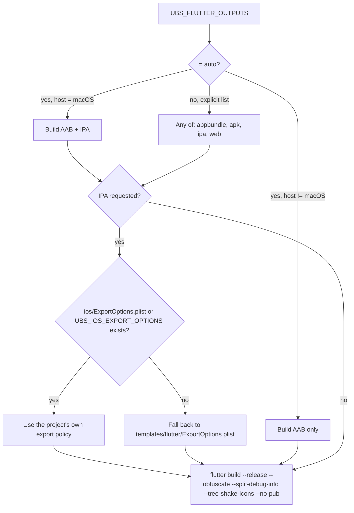
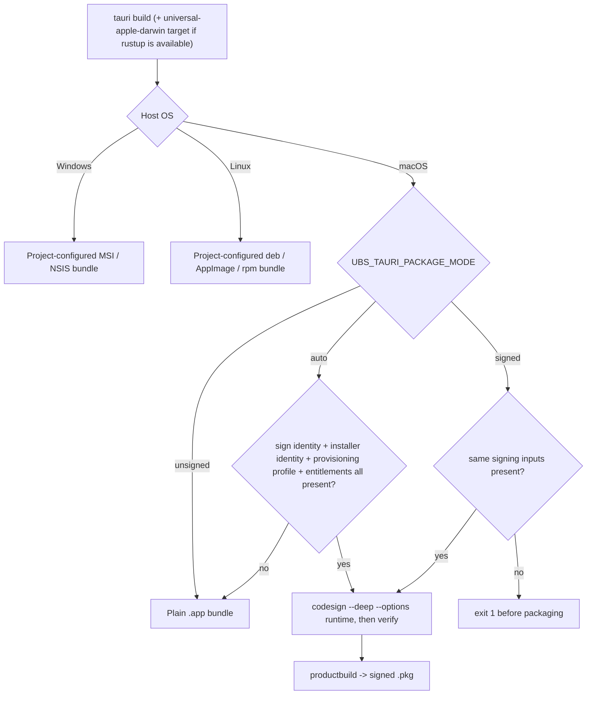
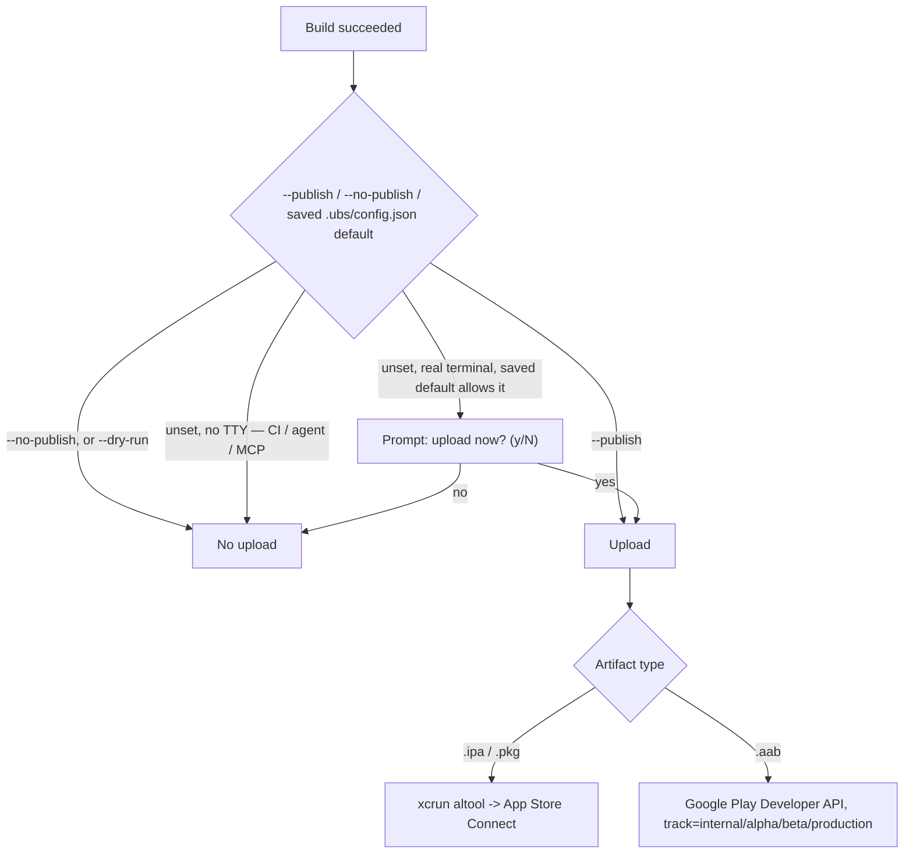
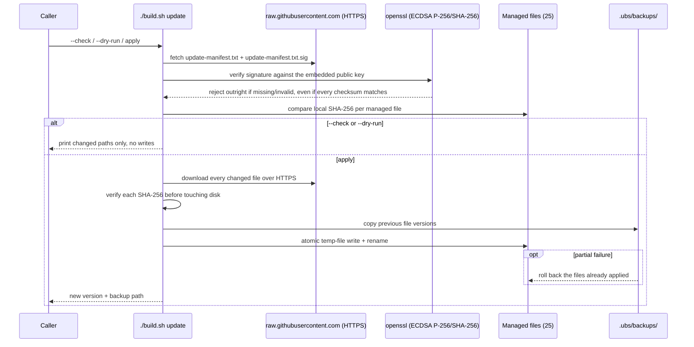
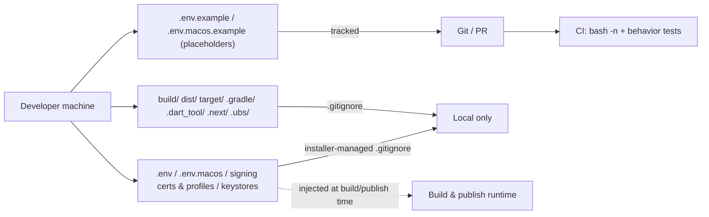

<div align="center">

# Universal Build Script

[한국어](README.md) · [English](README.en.md) · [日本語](README.ja.md) · [简体中文](README.zh-CN.md)

**A single `./build.sh` entry point that detects, dependency-orders, and release-builds Flutter, Tauri, Xcode iOS, Android/Kotlin/Gradle, React/Next.js, and Node projects — the same way for humans, CI, AI agents, and MCP clients.**


[](https://github.com/Loop-Suite/Universal-Build-Script/actions/workflows/validate.yml)


[Quick start](#quick-start) · [Architecture](#architecture-and-flow) · [Supported types](#supported-project-types) · [Commands](#commands-and-options) · [Publishing](#publishing-to-app-stores) · [Security](#safe-runtime-updates) · [Troubleshooting](#troubleshooting)

</div>

---

## What it does

Universal Build Script (UBS) decides whether the current directory is a single project or a monorepo root, detects every buildable project underneath it, removes nested duplicates (a Flutter app's own `android/`, `ios/`, `macos/` folders are never registered as separate Gradle/Xcode projects), infers inter-project dependencies, schedules a topological build order, and dispatches each project to the matching ecosystem adapter — Flutter, Tauri, Gradle (Android/Kotlin/Kotlin Multiplatform), Xcode-only iOS, or Node (React/Next.js/plain Node).

The orchestration core (`scripts/ubs.py`) is Python; the thin, stable entry point (`build.sh`) and the Flutter/Tauri ecosystem adapters remain Bash. A dependency-free stdio MCP server (`scripts/ubs_mcp.py`) exposes the same detect/audit/plan/graph/update surface to AI agents with read-only defaults and workspace-boundary enforcement.

Running with no arguments applies safe, review-friendly defaults:

| Concern | Default behavior |
|---|---|
| Interaction | Non-interactive (`UBS_NON_INTERACTIVE=true`) unless a real terminal answers the first-run question |
| App version | Left unchanged (`--version-bump none`) |
| Single project | Builds only that project |
| Monorepo root | Detects and builds every sub-project in dependency-topological order |
| Flutter cache | `flutter clean` is skipped (`UBS_SKIP_CLEAN=true`); cache is reused |
| Node install | Cached — reinstall skipped when workspace lock/config/patch/runtime inputs are unchanged |
| Monorepo parallelism | 1 (sequential); raise with `--jobs N` |
| Tauri packaging | Host-default bundle; signed `.pkg` only when every macOS signing input is present |
| One project fails | Independent projects keep building; the run returns an aggregate failure |
| Store publish | Never automatic outside a real terminal — see [Publishing](#publishing-to-app-stores) |
| Runtime self-update | Never performed by a normal build — only by the explicit `update` command |

> The user-facing entry point is the root `./build.sh`. Everything under `scripts/` is an internal adapter and is not meant to be invoked directly.

## Quick start

### Install

Run this from the project root you want to build, or from a monorepo root:

```bash
curl -fsSL https://raw.githubusercontent.com/Loop-Suite/Universal-Build-Script/main/install.sh | bash
```

Python 3.9+ is required. The Rust integrity helper is optional:

```bash
curl -fsSL https://raw.githubusercontent.com/Loop-Suite/Universal-Build-Script/main/install.sh \
  | UBS_BUILD_RUST_HELPER=true bash

# or, in an already-installed repo:
./scripts/build-rust-helper.sh
```

The installer stages and SHA-256-verifies the complete 25-file managed bundle (`VERSION`, `build.sh`, `install.sh`, the Python core, both MCP/update libraries, all Bash adapters, the Rust helper sources, the Flutter export template, and the `skills/universal-build` agent skill) against a signed manifest, then applies it as **one atomic transaction** — either everything lands or nothing does. Existing managed files are preserved by default; pass `UBS_FORCE=true` to overwrite them.

> **Upgrading from a 2.x install:** the 2.x updater cannot fetch the Python/Rust-managed files introduced in 3.x, so run the installer once with `UBS_FORCE=true`. After that, `./build.sh update` manages the full bundle going forward.

The installer also idempotently manages a `# BEGIN/END Universal Build Script` block in `.gitignore` (set `UBS_MANAGE_GITIGNORE=false` to opt out), and seeds `.env`/`.env.macos` from the matching `.example` file on first install only — it never overwrites a file you already created. For a Flutter project with an `ios/` folder it also seeds `ios/ExportOptions.plist` from `templates/flutter/ExportOptions.plist` if one doesn't already exist.

### Verified install (recommended)

`curl | bash` pulls the installer, the embedded public key, the manifest, and the payload from the same GitHub-hosted channel — so signature verification alone cannot detect a compromise of that channel itself (see [Safe runtime updates](#safe-runtime-updates) for the full trust-root discussion). To check provenance from an independent root of trust before running anything, verify the [GitHub Artifact Attestation](https://docs.github.com/en/actions/security-for-github-actions/using-artifact-attestations/using-artifact-attestations-to-establish-provenance-for-builds) that `.github/workflows/attest-release.yml` publishes for every tagged release:

```bash
curl -fsSL https://raw.githubusercontent.com/Loop-Suite/Universal-Build-Script/main/install.sh -o install.sh
gh attestation verify install.sh --owner Loop-Suite   # built into gh CLI 2.49+, no cosign needed
bash install.sh
```

This confirms, via the public Sigstore Rekor transparency log, that `install.sh` was built by a GitHub Actions workflow in `Loop-Suite/Universal-Build-Script` at tag-release time — signed keylessly through GitHub's OIDC issuer (Fulcio), not a key an attacker could steal by compromising only the repository or a maintainer account.

### Run

```bash
./build.sh
```

Inspect before building anything:

```bash
./build.sh detect
./build.sh audit
./build.sh --dry-run
```

Choose the version bump and Flutter platform from a menu instead of the safe defaults:

```bash
./build.sh --interactive
```

## AI and MCP integration

The repository ships [`skills/universal-build`](skills/universal-build/SKILL.md), an agent skill describing the safe workflow:

```text
detect --json → audit --json → plan --json → explicit user approval → build --report-json
```

It instructs an agent to treat JSON output as the machine contract, never invoke `scripts/ubs.py` directly, never silently add signing/notarization/publishing, and never bump the app version unless explicitly asked. `skills/universal-build/references/optimization.md` documents how to interpret `audit` output, and `skills/universal-build/agents/openai.yaml` declares the skill's display metadata for OpenAI-compatible agent runtimes.

For MCP, run the bundled dependency-free stdio server:

```bash
UBS_MCP_ROOT=/absolute/path/to/workspace python3 /absolute/path/to/scripts/ubs_mcp.py
```

It exposes `ubs_detect`, `ubs_audit`, `ubs_plan`, `ubs_graph`, and `ubs_update_check` by default — all read-only. `ubs_build` stays hidden unless the server is started with `UBS_MCP_ALLOW_BUILD=true`, and even then a real (non-dry-run) build additionally requires the caller to pass `confirm=true`. Every path argument is resolved against `UBS_MCP_ROOT` and rejected if it would resolve outside that root; arbitrary shell fragments are not accepted as arguments.

## Architecture and flow



### Detection precedence

`scripts/lib/detect.sh` (and its Python equivalent in `ubs.py`) walks candidate directories in this fixed order so a Tauri app's bundled frontend, or a Flutter app's platform folders, are never double-registered:



Precedence is **Tauri → Flutter → Xcode → Gradle → Node**, and directories such as `.git`, `node_modules`, `build`, `dist`, `target`, `.gradle`, `.dart_tool`, `.next`, and `.ubs` are pruned from the recursive scan.

### Language and runtime boundaries



The project is deliberately not shell-only: Python owns dependency inference/scheduling because bounded concurrency (`--jobs N`) and cycle-safe topological ordering are impractical to keep correct in Bash across ecosystems. The Rust helper is a batch SHA-256 verifier only — it accelerates and hardens the runtime updater and is never required for a normal build; a portable Python/OpenSSL fallback is used when it's absent.

### Build and report contract



Exit code `0` means every selected project succeeded; `1` means a discovery/build failure or no matching project; `2` means invalid arguments.

### Monorepo failure policy



## Supported project types

| Type | Detection marker | Default action | Typical output |
|---|---|---|---|
| Tauri 2 | `src-tauri/tauri.conf.json` | package manager `tauri build` | native OS bundle; signed `.pkg` on macOS when signing is complete |
| Flutter | Flutter SDK reference in `pubspec.yaml` | selected release outputs | AAB, split-per-ABI APK, IPA, Web, separated debug symbols |
| Xcode-only iOS | root `*.xcworkspace` or `*.xcodeproj` | Release archive; optional IPA export | `.xcarchive`, `.ipa` |
| Android | Android Gradle Plugin in `build.gradle(.kts)` | `bundleRelease` on the app module, else `build` | project-defined Gradle outputs |
| Kotlin Multiplatform | KMP Gradle plugin | `build` | target-specific outputs |
| Kotlin/JVM or plain Gradle | Gradle configuration without AGP/KMP | `build` | JAR or project-defined outputs |
| Next.js / React / Node | `package.json` with a string `scripts.build` | package manager build script | `.next`, `dist`, `build`, or project-defined |

## Commands and options

```text
./build.sh                          auto-detect + unattended build with safe defaults
./build.sh detect [PATH]            list detected sub-projects
./build.sh detect --json [PATH]     JSON detection result, for AI/MCP
./build.sh audit [PATH]             optimization/obfuscation configuration audit
./build.sh audit --json [PATH]      JSON audit result
./build.sh plan [PATH]              read-only build plan
./build.sh plan --json [PATH]       JSON build plan
./build.sh graph --json [PATH]      dependency graph + topological layers as JSON
./build.sh update --check [--json]  check the full runtime bundle for updates
./build.sh update --dry-run         preview changed files without writing
./build.sh update                   verify, back up, and apply an update
./build.sh update --prune-backups 30   delete update backups older than 30 days
./build.sh --dry-run                preview which projects would build
./build.sh --interactive            choose version bump / platform from a menu
./build.sh build --project PATH     build one project (plus detected prerequisites)
./build.sh build --all --type TYPE  build only projects of one type
./build.sh publish [--project PATH] [--track TRACK]   upload already-built store artifacts
```

`./build.sh list` is an alias for `detect`. `-h` / `--help` prints the same usage text.

| Option | Meaning |
|---|---|
| `--version-bump none\|build\|patch\|minor\|major` | App version policy |
| `--flutter-outputs auto\|LIST` | Comma list of `appbundle`, `apk`, `ipa`, `web` |
| `--flutter-platform auto\|all\|ios\|android` | Legacy platform selection, applies only when outputs are `auto` |
| `--project PATH` | Build one target plus its detected prerequisite projects |
| `--all --type TYPE` | Filter monorepo projects by detected type |
| `--clean` / `--skip-clean` | Force/skip `flutter clean` |
| `--obfuscate-js` / `--no-obfuscate-js` | Force Tauri frontend JS obfuscation on/off |
| `--publish` / `--no-publish` | Force/disable a store upload after a successful build |
| `--track TRACK` | Google Play track for `publish` (`internal`, `alpha`, `beta`, `production`) |
| `--fail-fast` | Stop scheduling new projects after the first failure |
| `--jobs N` | Bounded parallelism for independent projects in the same layer |
| `--non-interactive` / `--interactive` | Override the saved/auto-detected interaction mode |
| `--report-json PATH` | Write per-project status and discovered artifacts as JSON |

### Opening output folders after a build

After every selected project finishes, an interactive local terminal opens each successful output location with Finder, Explorer, or `xdg-open`. `UBS_OPEN_OUTPUT=auto` (default) never opens a GUI in CI or a non-interactive pipe; set it to `true` to force opening or `false` to disable it (the older `UBS_NO_OPEN=true` still works as an off switch). This is best-effort and can never turn a successful build into a failed one; `UBS_NO_NOTIFY=true` separately disables the macOS sound/voice/notification on completion.

## Flutter builds

`scripts/build-flutter.sh` runs `flutter clean` (unless `UBS_SKIP_CLEAN=true`) and `flutter pub get`, then builds the requested outputs in release mode with `--obfuscate`, `--split-debug-info`, and `--tree-shake-icons` (native Web output does not support Dart obfuscation). If both Android and iOS are selected and no interactive `.build_prefs` preference exists yet, an interactive run asks whether to build them sequentially (default) or concurrently in the background.



`--dart-define-from-file` is applied automatically from `.env.prod` if present, else `.env`, else the build proceeds with no injected values. On success, a version bump is committed to `pubspec.yaml` with `git commit`; if the build fails or is cancelled partway through, the version is restored via an `EXIT` trap so an uncommitted diff never accumulates. Outputs land at `build/app/outputs/bundle/release` (AAB), `build/app/outputs/flutter-apk` (APK), `build/ios/ipa` (IPA), and `build/web` (Web).

## Tauri builds

`scripts/build-tauri.sh` is a cross-platform entry point that execs into `scripts/build-tauri-macos.sh`, which runs the shared Tauri build flow everywhere and layers Apple signing/packaging on top only when the host is macOS. Signing configuration is read from `.env.macos` (parsed as plain key=value pairs — never `source`d, so shell substitution cannot execute) and looks for `TAURI_SIGN_IDENTITY`, `TAURI_INSTALLER_IDENTITY`, `TAURI_PROVISION_PROFILE`, `TAURI_ENTITLEMENTS`, and `TAURI_OBFUSCATE_JS`.



On macOS with `rustup` available, the build defaults to a universal binary (`--target universal-apple-darwin`, merging `aarch64`/`x86_64` via `lipo` into one `.app`); set `TAURI_UNIVERSAL_MACOS=false` for a host-arch-only build. Frontend JS obfuscation is off by default (`--obfuscate-js` to enable); when on, `dist/` is obfuscated in place with the lockfile-pinned `javascript-obfuscator` before `tauri build` repackages it with `beforeBuildCommand` disabled so the CLI doesn't overwrite the obfuscated output. Package manager selection uses the project's `packageManager` field, then lock files, in order: pnpm, Yarn, Bun, npm, using a frozen/immutable install where the manager supports it.

## Android, Kotlin, and Gradle builds

`scripts/build-gradle.sh` is a thin compatibility wrapper that execs `scripts/ubs.py gradle-adapter`; all task selection lives in the Python core. The detected subtype (`android`, `kotlin-multiplatform`, `kotlin`, or generic `gradle`) picks the default task — `bundleRelease` on the app module for Android, otherwise `build`. Override with `UBS_GRADLE_TASK` (e.g. a product flavor like `:app:bundleProdRelease`), pass extra flags with `UBS_GRADLE_FLAGS`, and opt into `--build-cache --parallel` with `UBS_GRADLE_OPTIMIZE=true`.

## Xcode-only iOS builds

For a root directory containing an `*.xcworkspace`/`*.xcodeproj` with no Tauri or Flutter marker, UBS archives a shared scheme in Release configuration on macOS. Set `UBS_XCODE_SCHEME` when multiple schemes are ambiguous, `UBS_XCODE_CONFIGURATION` to override `Release`, `UBS_XCODE_EXPORT=true` plus `UBS_XCODE_EXPORT_OPTIONS` to export an IPA after archiving, and `UBS_XCODE_FLAGS` for extra `xcodebuild` arguments. Output lands under `build/ubs`.

## React, Next.js, and Node builds

`scripts/build-node.sh` is a compatibility wrapper that execs `scripts/ubs.py node-adapter`; execution and dependency-install caching live entirely in the Python core so every direct or indirect caller shares one implementation. The `next`/`react`/`node` subtype is only cosmetic — all three run the same `scripts.build` entry via the detected package manager. Override the script name with `UBS_NODE_BUILD_SCRIPT` (default `build`). Dependency installation is skipped when `UBS_INSTALL_MODE=auto` (default) hashes workspace package manifests, lock files, `.npmrc`/`.yarnrc(.yml)`/`pnpm-workspace.yaml`, patches, and the manager/runtime version to the same result as last time; force a clean reinstall with `UBS_INSTALL_MODE=always`, or skip installation entirely with `UBS_SKIP_INSTALL=true`.

## Project dependency graph

`./build.sh graph --json` returns `nodes`, dependency `edges`, and topological `layers`, inferred from Node workspace package references, Flutter `path:` dependencies, and Gradle `includeBuild(...)` composites. `--jobs N` builds are scheduled on exactly this graph: independent projects in one layer may run concurrently, a failed layer blocks its dependents, and projects sharing a Node workspace (or with an ancestor/descendant path relationship) are automatically serialized regardless of `--jobs`. Add relationships the inference can't see — generated code, custom task wiring — in `ubs.dependencies.json` at the workspace root:

```json
{"schema_version": 1, "dependencies": {"apps/web": ["packages/ui"]}}
```

Paths must stay inside the workspace and dependency cycles are rejected.

## Publishing to app stores

`./build.sh publish [--project PATH] [--track TRACK]` **uploads already-built store artifacts — it never rebuilds anything.** `.ipa`/`.pkg` artifacts go through `xcrun altool --upload-package` using `ASC_API_KEY_ID`, `ASC_API_ISSUER_ID`, `ASC_APPLE_ID`, and `ASC_BUNDLE_ID`; `.aab` artifacts go through the Google Play Developer API using `GOOGLE_PLAY_SERVICE_ACCOUNT_JSON` and `GOOGLE_PLAY_PACKAGE_NAME`. All of these credentials must already be configured by the caller — UBS reports missing prerequisites rather than fabricating them.



A post-build publish prompt is only ever offered at a real terminal on a project's first publishable build — the answer is remembered in `.ubs/config.json`, the same TTY-gated pattern used for the interactive-vs-unattended and JS-obfuscation first-run questions. Agent, MCP, and CI runs are never prompted and never auto-publish, regardless of any saved local default. `GOOGLE_PLAY_TRACK` defaults to `internal`; targeting `production` outside of an explicit `--track production` produces a warning.

## Safe runtime updates

A normal build never downloads UBS code — updates are a separate, explicit action:

```bash
./build.sh update --check
./build.sh update --dry-run
./build.sh update
./build.sh update --check --json
./build.sh update --prune-backups 30
```



The manifest is protected by an ECDSA P-256/SHA-256 signature baked into both `install.sh` and `scripts/lib/update.sh`; the private signing key never leaves the release maintainer's local machine (never a CI secret, which would defeat the point if the account or repo were ever compromised). Regenerate and re-sign the manifest before a release:

```bash
scripts/generate-update-manifest.sh > scripts/update-manifest.txt
scripts/sign-update-manifest.sh   # default key path: ~/.ubs-release-signing/ubs-manifest-signing-key.pem
```

CI (`validate.yml`) rejects a release where the manifest, the actual file hashes, or the two embedded public-key copies disagree.

**The initial install and a later update do not share the same root of trust.** The first `curl | bash` install pulls the installer, public key, manifest, and payload from the same GitHub channel — so a compromise of that channel could in theory forge all four together. Once UBS is installed, though, the public key lives on local disk (fixed inside your already-installed `install.sh`/`scripts/lib/update.sh`), so a later repository compromise cannot forge a manifest your local copy will accept. Manifest signing is therefore effective against **post-install supply-chain tampering**, not against a **repository compromise at first-install time** — for that, use [Verified install](#verified-install-recommended)'s GitHub Artifact Attestation, or at minimum compare this fingerprint (also printed by `install.sh` itself at install time) before trusting a fresh install:

```
MANIFEST_PUBLIC_KEY fingerprint (SHA-256):
5600ca18df518517fa44ff96673ef7fbdbe7d27b8168228d32d75fc7fbae4064
```

## Privacy and secret hygiene

The installer manages a `.gitignore` block that excludes `.ubs/`, `.env`/`.env.*` (except `*.example`), `signing/`, and Apple/Android signing material (`*.p12`, `*.p8`, `*.pem`, `*.key`, `*.cer`, `*.mobileprovision`, `*.provisionprofile`, `*.entitlements`, `*.jks`, `*.keystore`, `key.properties`, `local.properties`, `GoogleService-Info.plist`, `google-services.json`). `.env.example` and `.env.macos.example` must hold placeholders only.



```bash
git status --short
git check-ignore .env .env.macos signing/App.provisionprofile build/app.aab
```

`.gitignore` rules do not erase already-tracked files or commit-author metadata; rotate any credential that was ever committed before relying on history rewriting. Remember that `dart-define` values are extractable from a compiled Flutter app and Vite's `VITE_*` values are bundled straight into the frontend — only put values meant to be public (e.g. a Supabase anon key) there, never a service-role key or private API secret.

## Environment variables

| Variable | Default | Meaning |
|---|---|---|
| `UBS_NON_INTERACTIVE` | `true` unless a real terminal set it via first-run prompt | Unattended vs. interactive execution |
| `UBS_VERSION_BUMP` | `none` | `none\|build\|patch\|minor\|major` |
| `UBS_FLUTTER_PLATFORM` | `auto` | Legacy platform choice when outputs are `auto` |
| `UBS_FLUTTER_OUTPUTS` | `auto` | Comma list of `appbundle,apk,ipa,web` |
| `UBS_IOS_EXPORT_OPTIONS` | `ios/ExportOptions.plist` | Override the Flutter IPA export plist path |
| `UBS_SKIP_CLEAN` | `true` | Skip `flutter clean` |
| `UBS_SKIP_INSTALL` | `false` | Skip Node dependency installation |
| `UBS_INSTALL_MODE` | `auto` | Node install caching; `always` forces reinstall |
| `UBS_JOBS` | `1` | Max parallel independent projects |
| `UBS_GRADLE_TASK` | auto-selected | Force a specific Gradle task |
| `UBS_GRADLE_OPTIMIZE` | `false` | Opt into `--build-cache --parallel` |
| `UBS_GRADLE_FLAGS` | empty | Extra Gradle CLI arguments |
| `UBS_NODE_BUILD_SCRIPT` | `build` | `package.json` script name to run |
| `UBS_XCODE_SCHEME` | auto | Required when multiple Xcode schemes exist |
| `UBS_XCODE_CONFIGURATION` | `Release` | Xcode build configuration |
| `UBS_XCODE_EXPORT` | `false` | Export an IPA after archiving |
| `UBS_XCODE_EXPORT_OPTIONS` | `ExportOptions.plist` | Xcode export plist path |
| `UBS_XCODE_FLAGS` | empty | Extra `xcodebuild` arguments |
| `UBS_TAURI_PACKAGE_MODE` | `auto` | `auto\|signed\|unsigned` macOS packaging policy |
| `TAURI_UNIVERSAL_MACOS` | `true` | Universal `aarch64`+`x86_64` macOS binary |
| `TAURI_OBFUSCATE_JS` | `false` | Obfuscate the Tauri frontend `dist/` before packaging |
| `UBS_OPEN_OUTPUT` | `auto` | Open successful output folders on a local TTY; `true`/`false` override |
| `UBS_NO_OPEN` | `false` | Legacy off switch for folder opening |
| `UBS_NO_NOTIFY` | `false` | Skip macOS sound/voice/notification on completion |
| `UBS_ALLOW_SELF_UPDATE` | deprecated | Prints a notice to use `./build.sh update` instead |
| `UBS_UPDATE_BASE_URL` | official `main` raw URL | Private mirror or test source for updates |
| `UBS_UPDATE_ALLOW_DOWNGRADE` | `false` | Explicitly allow applying a lower SemVer |
| `UBS_SIGNING_KEY` | `~/.ubs-release-signing/ubs-manifest-signing-key.pem` | Release-maintainer-only manifest signing key path |
| `UBS_BUILD_RUST_HELPER` | `false` | Build the optional Rust helper during install |
| `UBS_RUST_HELPER` | auto-detected | Point to an external Rust helper binary |
| `UBS_FORCE` | `false` | Overwrite existing managed files on install |
| `UBS_MANAGE_GITIGNORE` | `true` | Manage the protective `.gitignore` block |
| `UBS_INSTALL_REF` | current release tag | Immutable Git ref the installer fetches |
| `UBS_MCP_ROOT` | server start directory | Workspace boundary for the MCP server |
| `UBS_MCP_ALLOW_BUILD` | `false` | Expose the `ubs_build` MCP tool |
| `GOOGLE_PLAY_TRACK` | `internal` | Google Play publish track |
| `UBS_LANG` | `en` | CLI output language; supports `ko`/`en`/`ja`/`zh` |

Resolution order is `UBS_LANG` > `LC_ALL` > `LC_MESSAGES` > `LANG` > default `en`; anything unsupported falls back to `en`.

```bash
UBS_LANG=ja ./build.sh detect
```

`.env.macos` is parsed for exactly `TAURI_SIGN_IDENTITY`, `TAURI_INSTALLER_IDENTITY`, `TAURI_PROVISION_PROFILE`, `TAURI_ENTITLEMENTS`, and `TAURI_OBFUSCATE_JS` — as plain `key=value` text, never `source`d, so shell expressions or command substitution inside it are never executed.

## Optimization and obfuscation audit boundaries

`./build.sh audit` is a **static configuration review**, not a binary-level certification. It distinguishes four separate concepts and never conflates them: release **optimization** (compilation mode, minification, tree shaking, resource shrinking, LTO, stripping), deliberate **obfuscation** (name/control-flow transformation), **symbol separation** (debug info kept apart and required for crash symbolication), and **signing** (proves publisher identity/integrity — it optimizes or obfuscates nothing). For high-assurance release review, verify actual build outputs with ecosystem-specific tools in addition to this audit, and preserve Flutter symbol files, Android mapping files, native symbols, and required source maps.

## Repository structure

```text
Universal-Build-Script/
├── VERSION                          # managed-bundle version (currently 3.8.1)
├── build.sh                         # user entry point, aggregates exit status
├── install.sh                       # transactional installer (Python, exec'd from Bash)
├── scripts/
│   ├── ubs.py                       # detection, graph, scheduling, Node/Gradle/Xcode core
│   ├── ubs_mcp.py                   # path-scoped, read-only-by-default stdio MCP server
│   ├── bootstrap-update.sh          # recovery path when the Python core is missing
│   ├── build-flutter.sh             # Flutter AAB/APK/IPA/Web
│   ├── build-tauri.sh               # Tauri cross-platform entry point
│   ├── build-tauri-macos.sh         # shared Tauri build + macOS app/pkg signing
│   ├── build-gradle.sh              # compatibility wrapper -> ubs.py gradle-adapter
│   ├── build-node.sh                # compatibility wrapper -> ubs.py node-adapter
│   ├── build-rust-helper.sh         # builds the optional Rust helper
│   ├── generate-update-manifest.sh  # produces the SHA-256 manifest for managed files
│   ├── sign-update-manifest.sh      # ECDSA-signs the manifest for release
│   ├── update-manifest.txt / .sig   # published manifest + signature
│   ├── FLUTTER_VERSION / TAURI_VERSION
│   └── lib/
│       ├── detect.sh                # legacy-compatible detection + regression tests
│       ├── audit.sh                 # legacy-compatible optimization/obfuscation audit
│       ├── update.sh                # signature-verified update/backup/rollback
│       └── node-package-manager.sh  # npm/pnpm/yarn/bun shared logic
├── native/ubs-helper/                # optional Rust CLI: SHA-256 + safe-relative-path checks
│   ├── Cargo.toml / Cargo.lock
│   └── src/main.rs
├── templates/flutter/ExportOptions.plist  # generic App Store IPA export fallback
├── skills/universal-build/
│   ├── SKILL.md                     # agent-facing safe-workflow instructions
│   ├── agents/openai.yaml           # OpenAI-compatible agent skill metadata
│   └── references/optimization.md   # how to interpret audit results
├── tests/
│   ├── test-detection.sh / test-install.sh / test-python-adapters.sh
│   ├── test-update.sh / test-rust-helper.sh
│   └── test_python_core.py / test_mcp.py
├── .github/workflows/validate.yml        # Bash syntax + behavior tests on every PR/push
├── .github/workflows/attest-release.yml  # GitHub Artifact Attestation on tag release
├── .env.example / .env.macos.example
```

Adapters receive the target project directory as their working directory. Adding a new ecosystem means extending the detection order and the adapter map — the entry point and CLI contract stay the same.

## Testing and validation

```bash
bash -n build.sh install.sh scripts/*.sh scripts/lib/*.sh tests/*.sh
python3 -m py_compile scripts/ubs.py scripts/ubs_mcp.py
python3 tests/test_python_core.py
python3 tests/test_mcp.py
bash tests/test-detection.sh
bash tests/test-install.sh
bash tests/test-python-adapters.sh
bash tests/test-update.sh
bash tests/test-rust-helper.sh
scripts/generate-update-manifest.sh > /tmp/update-manifest.txt
diff -u scripts/update-manifest.txt /tmp/update-manifest.txt
```

This is exactly what `.github/workflows/validate.yml` runs on every pull request and push to `main`. Tests build temporary fixture monorepos and mock ecosystem commands rather than invoking real SDKs — they cover detection precedence and dedup (e.g. a Tauri+React app detected as one `tauri` project, not two), the dependency graph and cycle rejection, MCP path-escape rejection and the `ubs_build` opt-in gate, JSON schema stability for `detect`/`audit`/`plan`, update check/dry-run/apply with backup and SHA-256 verification, rejection of malicious manifest paths and symlink destinations, and the installer's atomic replace-with-rollback behavior. Real Flutter/Gradle/npm builds, Apple/Android code signing, and artifact-level reverse engineering remain out of scope and must be validated per project.

## Troubleshooting

- **Project not detected:** confirm the expected marker file is present and run `./build.sh detect`.
- **macOS unexpectedly builds iOS too:** pass `--flutter-platform android` or an explicit `--flutter-outputs` list.
- **Wrong Android flavor/task:** set `UBS_GRADLE_TASK=:app:bundleProdRelease` (or your task).
- **Tauri produces `.app` instead of `.pkg`:** run with `UBS_TAURI_PACKAGE_MODE=signed` — it will fail loudly and name the missing signing input instead of silently falling back.
- **Wrong package manager picked:** align the `packageManager` field in `package.json` with the committed lock file.
- **Ambiguous Xcode scheme:** set `UBS_XCODE_SCHEME` explicitly.
- **MCP tool call fails with a path error:** the requested path resolved outside `UBS_MCP_ROOT` — pass a path inside the configured workspace.

## Known limitations

- Builds are sequential by default; `--jobs N` runs non-overlapping projects within a topological layer only, and shared Node workspaces or ancestor/descendant paths stay serialized regardless.
- Automatic dependency inference covers Node package names, Flutter `path:` dependencies, and Gradle composite builds — generated-code or custom-task relationships need `ubs.dependencies.json`.
- Multiple Xcode schemes with no obvious default require `UBS_XCODE_SCHEME`.
- Gradle product flavors and custom release tasks are not auto-inferred.
- Kotlin Multiplatform runs the default `build` task; platform-specific deployment tasks are not auto-selected.
- Tauri JS obfuscation assumes a `dist/` frontend output directory and only runs the lockfile-installed local `javascript-obfuscator`.
- Artifact/report discovery searches known default output locations; projects that move outputs elsewhere may not show up automatically.
- Automatic folder-opening uses the same artifact-discovery rules, so custom output paths may need manual navigation.
- The update manifest supports optional external SHA-256 pinning, but the manifest signature itself does not extend to a first-install-time repository compromise — see [Safe runtime updates](#safe-runtime-updates).

## License

MIT License — Copyright © 2026 kimdzhekhon
